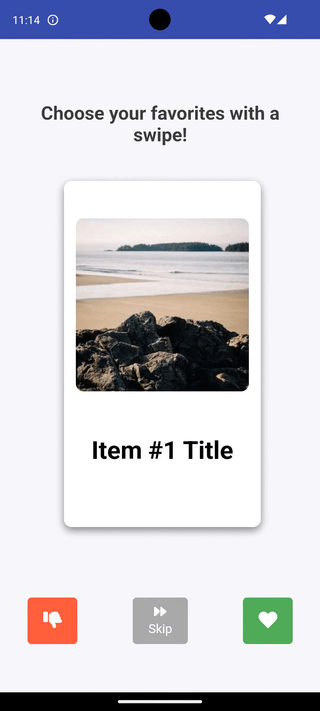

# Interactive In-App Message Templates

This repository contains interactive in-app message templates designed for use with Braze's Custom Code editor.

## Available Templates

| Template                                  | Description                                                                                                  | Preview                              |
|-------------------------------------------|--------------------------------------------------------------------------------------------------------------|--------------------------------------|
| [Memory Game](./memory-game) | An interactive memory game where users match pairs of cards. Completing unlocks a reward message. |  |
| [Scratch-Off Reveal](./scratch-off-reveal) | A lottery ticket scratch-off game where users reveal a hidden image after "scratching" off the surface. |  |
| [Card Swipe Survey](./swipe-survey)  | An interactive survey where users swipe through cards to indicate likes and dislikes similar to popular dating apps. Choices are saved to their profile for use in personalized messaging. |  |

---

## Getting Started

1. Navigate to the folder for the desired template (`memory-game`, `scratch-off`, or `swipe-survey`).
2. Follow the instructions in the respective `README.md` file to set up and customize the template.
3. Upload the necessary assets and test the in-app message to ensure proper functionality across devices.

---

